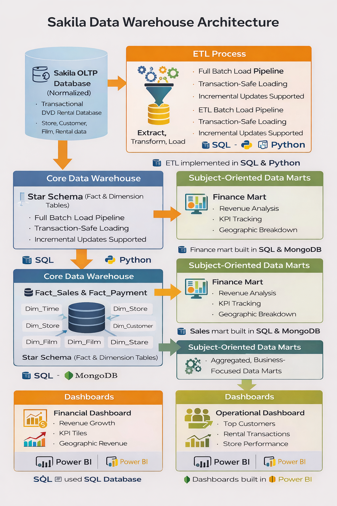

# 📊 Sakila Data Warehouse & Analytics Engineering Project

This project transforms the traditional Sakila DVD Rental OLTP database into a fully structured Data Warehouse with dimensional modeling, ETL pipelines, subject-oriented data marts, and executive-ready dashboards.

Instead of querying raw transactional tables, I designed and implemented a scalable warehouse architecture that separates operational data from analytical workloads — mirroring real-world enterprise data systems.

---

## 🏗 Architecture Overview

The system follows a layered data architecture:

• Normalized OLTP source database  
• Dimensional Star Schema (Fact & Dimension tables)  
• Transaction-safe ETL batch pipeline  
• Finance Data Mart (CFO-level reporting)  
• Sales & Inventory Data Mart (Operational analytics)  
• Power BI dashboards for business decision-making  

All transformations are handled using structured T-SQL ETL processes with identity reseeding, transactional control, and parameterized stored procedures.

---

## 🔄 ETL Pipeline

The ETL process:

• Clears and reloads dimension and fact tables  
• Resets identity seeds for consistency  
• Aggregates transactional data into analytics-ready fact tables  
• Loads subject-oriented data marts with indexed structures  
• Supports parameterized procedures for dynamic filtering (Year, Quarter, Date Range, Store, Transaction Type)

The design prioritizes data integrity, performance, and scalability.

---

## 💰 Finance Data Mart (Executive View)

Designed to support high-level financial analysis:

• Revenue trends by Year, Quarter, Month  
• Late fee tracking  
• Geographic revenue distribution  
• Store performance comparisons  
• Unique customer aggregation  
• Transaction volume analysis  

---

## 🎬 Sales & Inventory Data Mart (Operational View)

Designed to support product and customer analytics:

• Top performing films  
• Units transacted by store and date  
• Customer behavior analysis  
• Rental return rate calculations  
• Active vs inactive customer segmentation  

---

## 📈 Dashboards

Two Power BI dashboards were built on top of the data marts:

1. Financial Performance Dashboard
   - Revenue growth visualization
   - KPI cards (Revenue, Transactions, Unique Customers)
   - Geographic revenue analysis
   - Late fee breakdown
   - Monthly transaction distribution

2. Operational Dashboard
   - Total customers
   - Rental transactions
   - Top customers
   - Store-level performance insights

All dashboards are powered by warehouse-level aggregation — not raw OLTP queries.

---

## 🛠 Tech Stack

• SQL Server  
• T-SQL (Stored Procedures, Views, Indexing)  
• Dimensional Modeling (Star Schema)  
• ETL Engineering  
• Power BI  

---

## 🎯 What This Demonstrates

This project showcases:

• End-to-end Data Warehouse design  
• ETL pipeline development  
• Star schema modeling  
• Performance-aware indexing  
• Analytical stored procedure design  
• Business-focused dashboard development  

It reflects how raw transactional data can be transformed into decision-ready insights using structured data engineering practices.

## 👤 Author

Samuel Nono  
M.S. Data Science  

Data Engineering | Distributed Systems | Applied AI
